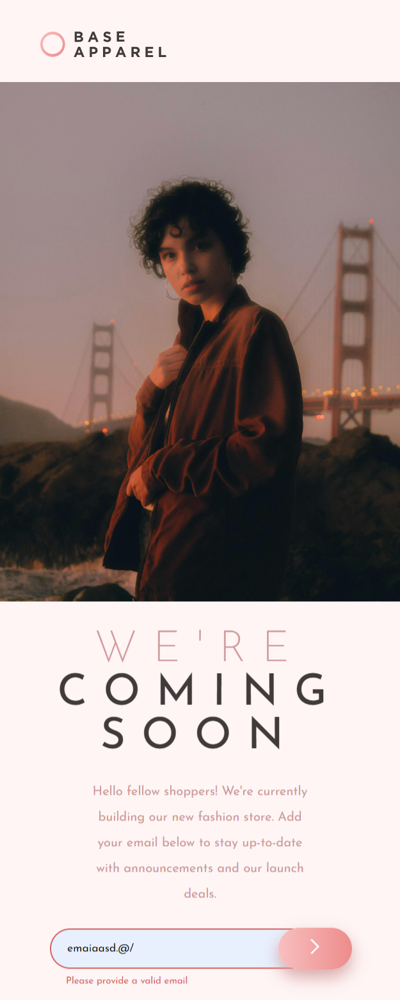

# Frontend Mentor - Base Apparel Coming Soon Page

## Welcome! 👋

This project is a responsive "Coming Soon" page for Base Apparel, built with HTML, CSS, and JavaScript. The page includes form validation for email input and provides error messages when the user submits invalid input. The design is optimized for various screen sizes including desktop, tablet, and mobile, ensuring a great user experience across devices. This project was developed as part of a Frontend Mentor challenge.

## Features:
- Responsive design for desktop, tablet, and mobile devices
- Email validation with clear error messages for invalid submissions
- Clean and modern layout with a focus on usability

## Screenshots:

### Desktop View:

### Desktop View with Error Message:

### Mobile View:

### Mobile View with Error Message:

### Tablet View:

### Tablet View with Error Message:

Feel free to explore the project and suggest any improvements or changes!
